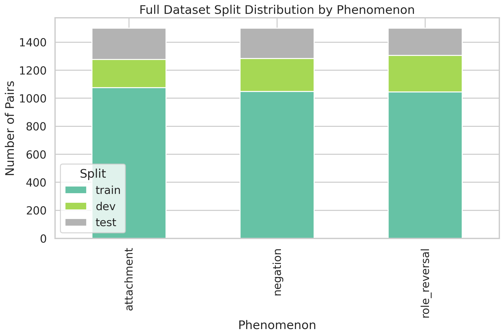
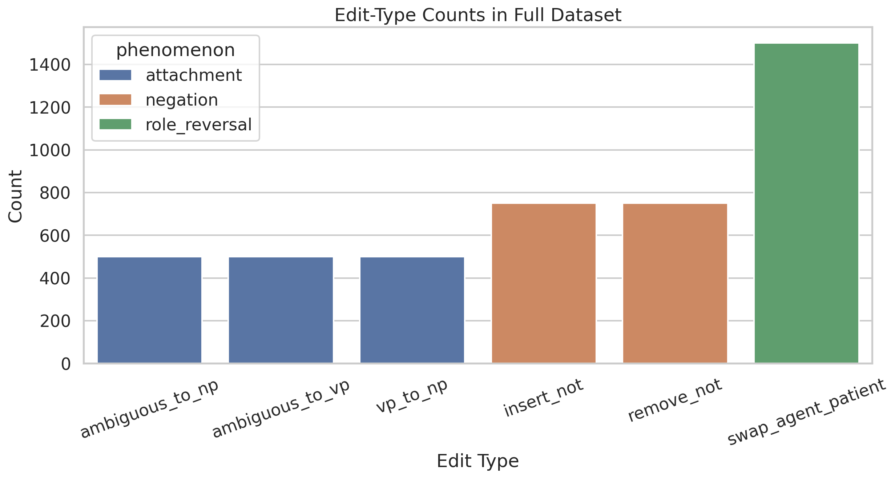
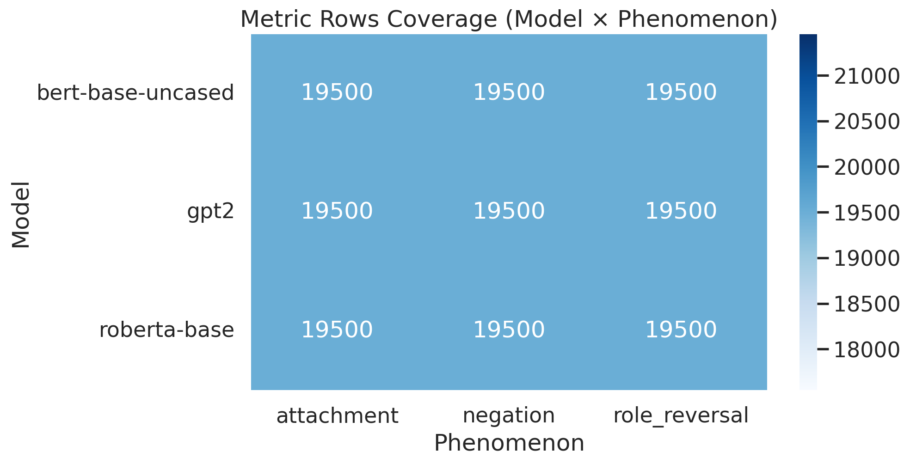
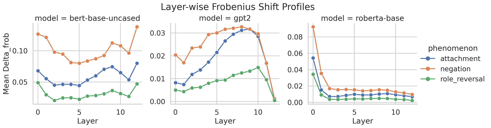
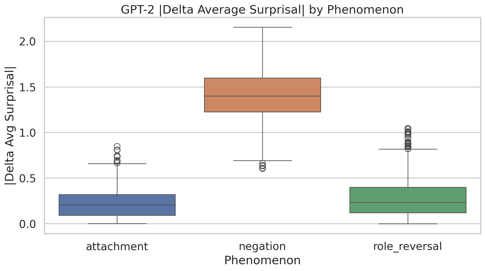
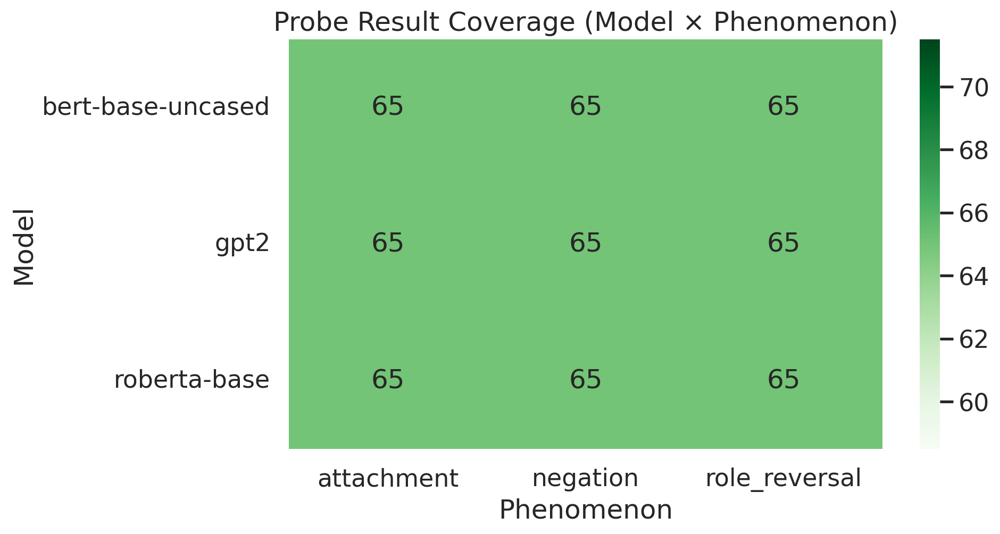
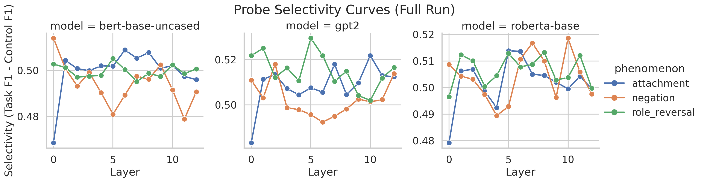
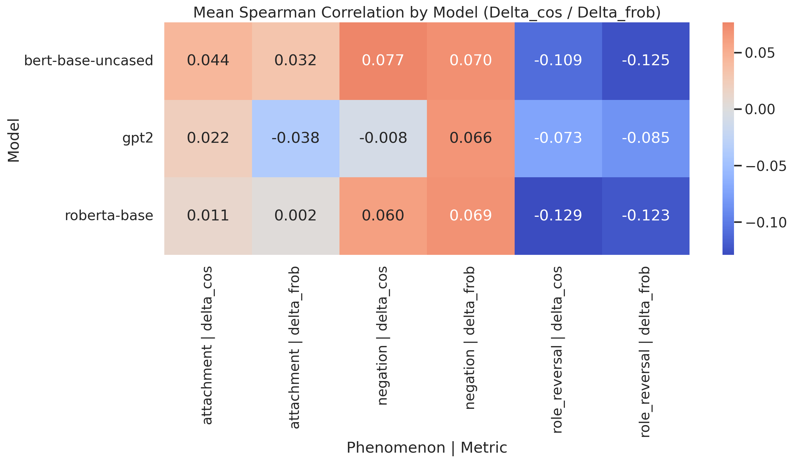
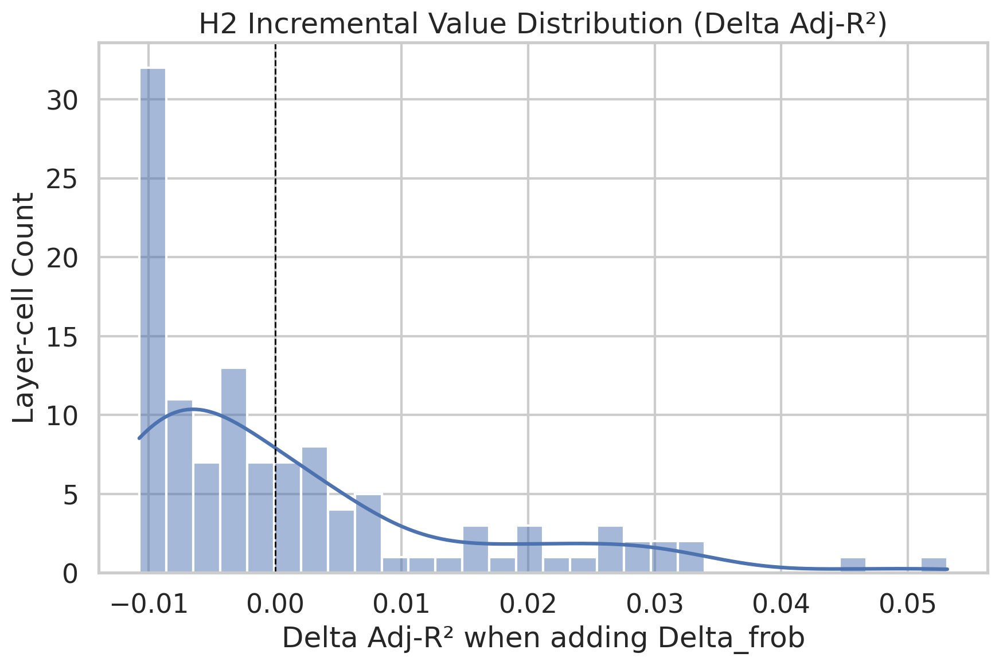
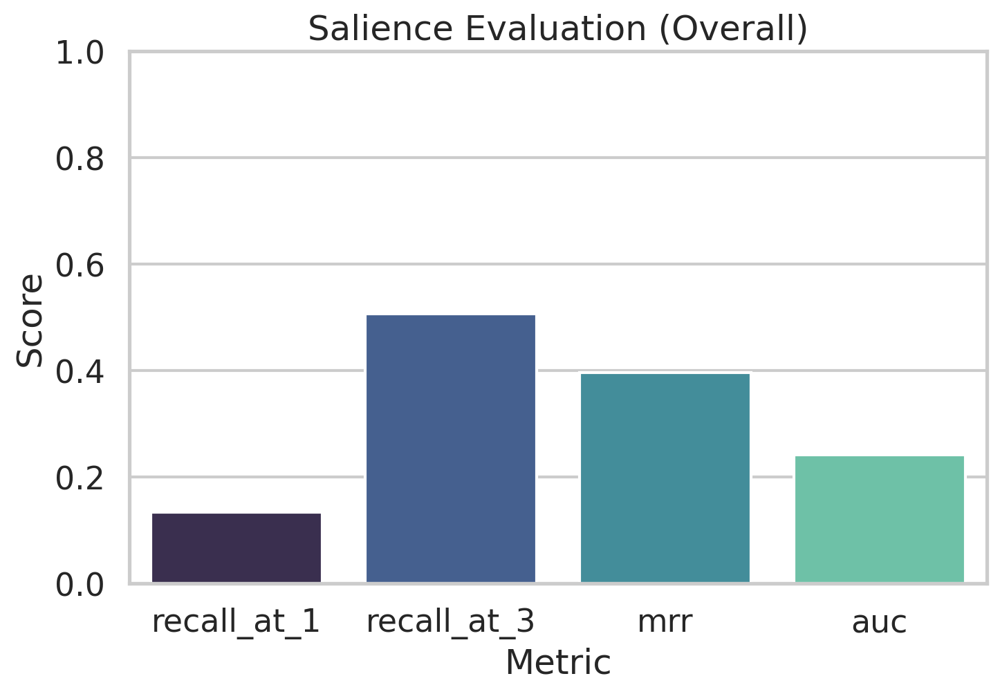

# CSS Mid Submission Update
## Counterfactual Structural Sensitivity (CSS)
### Human-Aligned Probing under Minimal Linguistic Edits

- Repo snapshot: `/home/srinath/Shyshtum/compsy`
- Status date: 2026-04-24
- Scope: what is complete now, what remains for final submission

---

# Mid Submission Goal

Deliver a defensible mid-stage milestone:

- Complete end-to-end implementation.
- Full-scale execution across planned models/datasets.
- Reproducible artifact pipeline (configs, hashes, logs, scripts).
- Transparent reporting of what is still pending for final claims.

---

# Problem Statement

Do internal LM representations shift in linguistically meaningful ways under minimal structural counterfactual edits, and do those shifts align with human semantic-change judgments (0-5)?

Primary phenomena:

- Role reversal
- Negation
- Attachment ambiguity

---

# Claim Boundary (Important)

This project currently claims:

- Structural sensitivity diagnostics and human-alignment testing protocol.

This project does **not** claim:

- LMs process language like humans.

No human reading-time/neural data is used.

---

# Hypotheses (H1-H5)

- H1: Larger representation shift correlates with larger human semantic-change.
- H2: Frobenius shift adds value beyond cosine shift.
- H3: Layer profiles differ by phenomenon.
- H4: Surprisal is complementary, not sufficient replacement.
- H5: Effects should survive control checks.

---

# Pipeline

\[
\text{sentence} \rightarrow \text{counterfactual edit} \rightarrow \text{hidden states} \rightarrow \Delta \text{metrics} \rightarrow \text{probes + surprisal} \rightarrow \text{human alignment stats}
\]

Implemented as config-driven scripts with serialized phase logs.

---

# Phase Progress Snapshot

Completed through full audit:

- Data generation/validation (Phases 1-2)
- Representation extraction + metrics + surprisal (Phases 3-5, 9)
- Probes + controls (Phase 6, refreshed)
- Annotation pipeline + agreement (Phase 7, 10)
- Stats + mixed effects (Phase 8, 11, refreshed)
- Salience + plots + paper packaging (Phases 12-13)
- Final audit (Phase 14: conditionally complete)

---

# Full Dataset Summary

- `role_1500.jsonl`: 1500
- `neg_1500.jsonl`: 1500
- `attach_1500.jsonl`: 1500
- merged full: `full_all_4500.jsonl`: 4500

Validation:

- 0 schema issues
- 0 duplicate IDs
- status `ok`

---

# Split Distribution (Full Dataset)

Counts:

- train 3169, dev 697, test 634

---

# Edit-Type Distribution

Balanced generation design was preserved:

- role swap 1500
- neg insertion/removal 750/750
- attachment variants 500/500/500

---

# Models and Layer Scope

Primary models:

- `bert-base-uncased`
- `roberta-base`
- `gpt2`

Layer scope:

- 13 layers total (embedding layer 0 + transformer layers 1..12)

---

# Representation/Metrics Coverage

Rows in full metrics table:

- 175,500 (all model × phenomenon × pair × layer cells)

---

# Core Metric Definitions

\[
\Delta_{\cos} = 1 - \cos(\mu(s), \mu(s'))
\]

\[
\text{sim}_{\text{frob}} = \frac{\|K(A,B)\|_F}{\sqrt{\|K(A,A)\|_F\|K(B,B)\|_F+\epsilon}}, \quad \Delta_{\text{frob}}=1-\text{sim}_{\text{frob}}
\]

\[
\Delta_{L2}=\|\mu(s)-\mu(s')\|_2
\]

\[
\Delta_{\text{tok}}=\frac{1}{|M|}\sum_{(i,j)\in M} \left(1-\cos(h_i,h'_j)\right)
\]

---

# Layer-wise Frobenius Profiles

Takeaway:

- Layer sensitivity patterns differ by model and phenomenon, supporting H3-style profiling diagnostics.

---

# GPT-2 Surprisal (Primary Psycholinguistic Covariate)

- `gpt2_surprisal_full.csv`: 4500 rows
- key-region coverage: 1.0
- mean |delta avg surprisal|: 0.6421

---

# Surprisal by Phenomenon

Observation:

- Negation induces larger surprisal deltas than role/attachment in current generated data.

---

# Probe Pipeline Status (After Fixes)

Critical fixes applied:

- Corrected `*_cf` label key mapping for negation/attachment probes.
- Corrected GPT-2 token-to-word overlap mapping in representation extraction.

Result:

- Full probe coverage now achieved.

---

# Probe Coverage Matrix (Now Complete)

Rows:

- 585 = 3 models × 3 phenomena × 13 layers × 5 seeds

---

# Probe Selectivity Curves

Average selectivity:

- ~0.5036 (macro-F1 task minus random-label control)

---

# Human Annotation Status (Mid)

Pipeline-ready annotation assets exist:

- 300 balanced pairs (`annotation_batch_full.csv`)
- 3 ratings per pair in current run files

But:

- current full annotation file is **simulated fallback** (`simulate_annotations.py`), not real annotator collection.

---

# Why This Matters for Claims

Human-alignment (H1/H4/H5) requires real human judgments.

Current status:

- engineering/statistics pipelines are complete and rerunnable
- final scientific interpretation remains provisional until real ratings replace simulated fallback file

---

# Correlation Summary (Current Full Run)

Stats snapshot:

- 468 correlation rows
- Spearman FDR-significant cells: 0

---

# H2 Incremental Value Distribution

Current full-run snapshot:

- positive delta adj-\(R^2\) cells: 46/117
- FDR-significant Frobenius incremental terms: 0

---

# Mixed-Effects Status

Current full run:

- 13/13 layer models fit
- convergence: true for all layers
- robust fallback for singular fixed-effect sets implemented

Model includes:

- fixed effects: delta metrics, surprisal, controls, model/phenomenon factors
- random effects: pair and annotator components

---

# Salience (Exploratory) Status

Current overall:

- Recall@1: 0.1336
- Recall@3: 0.5063
- MRR: 0.3965
- AUC: 0.2423

---

# Mid-Submission What We Can Defend

Defensible now:

- Protocol and implementation novelty (CSS combination).
- Full engineering completion on planned model set.
- Full-scale reproducible artifacts and logs.
- Corrected probe coverage and rerun evidence.
- Transparent limitations and risk accounting.

---

# Mid-Submission What We Should Not Overclaim

Avoid claiming:

- Final human-alignment conclusions
- Cognitive equivalence to human language processing
- Strong statistical confirmation of H1-H5

Reason:

- Human ratings currently simulated fallback.

---

# Technical Risks Closed Since Last Iteration

Closed:

- Incomplete probe coverage due side-key bug.
- GPT-2 word-matrix mismatch affecting span indexing.
- Mixed-effects singular failures after probe refresh.

Artifacts refreshed:

- probes, stats, salience, figures, logs.

---

# Remaining Work for Final Submission

Mandatory:

1. Collect real human annotations for the 300-pair balanced set (or expanded set).
2. Replace `human_css_0_5_full.csv` with real labels.
3. Rerun full stats and regenerate final figures/tables.
4. Update manuscript claims and confidence intervals from real data.

---

# Final Submission Message (Planned)

- Mid: “engineering complete, human-alignment result provisional.”
- Final: “human ratings integrated; final hypothesis claims reported from real annotations.”

This keeps credibility high and avoids overclaim risk.

---

# Reproducibility Assets

- Config-driven runs: `configs/experiments/*.yaml`
- Scripts: `scripts/run_full_metrics.sh`, `run_probes.sh`, `run_stats.sh`, `run_salience_and_plots.sh`
- Full logs: `logs/incremental/phase_00..14.jsonl`
- Final phase audit: `reports/phases/phase_14.md`

---

# Appendix: Exact Mid Snapshot Numbers

- full pairs: 4500
- metrics rows: 175,500
- surprisal rows: 4500
- probes rows: 585 (0 skipped)
- correlations rows: 468
- h2 rows: 117
- mixed-effects rows: 13
- salience contribution rows: 174,000

---

# Citations

- Devlin et al. (2019), BERT
- Liu et al. (2019), RoBERTa
- Radford et al. (2019), GPT-2
- Warstadt et al. (2020), BLiMP
- Hewitt & Liang (2019), probe controls
- Ettinger (2020), psycholinguistic diagnostics
- Levy (2008), surprisal
- Salazar et al. (2020), MLM PLL
- vor der Brück & Pouly (2019), matrix-norm similarity motivation

---

# End

Mid-submission framing:

- **Strong technical completion**
- **Transparent scientific boundary**
- **Clear, low-risk path to final submission**

